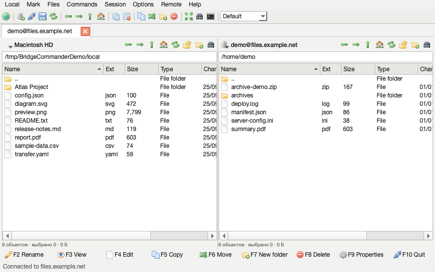

<h1 align="center">Bridge Commander</h1>

A compact two-pane file transfer client for macOS.

  

  

<strong>Скачать Bridge Commander 0.1.1 для Mac с Apple Silicon</strong>

## Что умеет

Bridge Commander показывает локальные и удалённые файлы в двух панелях. Можно подключаться по SFTP, SCP, FTP, FTPS, WebDAV и к S3, перемещаться по папкам, копировать и переносить файлы, переименовывать их, удалять, создавать каталоги, просматривать и редактировать текст. Есть сохранённые подключения, вкладки, очередь операций, поиск, сравнение папок и предварительный просмотр синхронизации. Пароли сохранённых подключений хранятся в Связке ключей macOS.

Для SFTP и SCP кнопка терминала открывает отдельное окно с интерактивной SSH-оболочкой на уже установленном соединении. Окно начинает работу в текущей удалённой папке. У FTP, WebDAV и S3 нет SSH-оболочки, поэтому терминал для них недоступен.

Оформление компактное, с переключением светлой и тёмной темы. Кнопка с глобусом слева открывает окно подключения.

**Скачать:** нажми чёрную кнопку выше и распакуй архив. Сборка предназначена для Mac с Apple Silicon. Для сборки из исходников нужен Python 3.11: `./build.sh`.

**Подпись:** эта версия собрана с локальной технической подписью, без сертификата Apple Developer ID и нотариального подтверждения. При первом запуске macOS может показать предупреждение. Для обычного запуска на чужих Mac без такого предупреждения нужен сертификат Developer ID и нотариальное подтверждение Apple.

## About

An independent Commander-style transfer app for Apple Silicon Macs. Browse local and remote files, transfer them across supported protocols, and manage saved sites in a familiar two-pane layout. The screenshot and the files in [`demo-files`](demo-files/) contain fictional data only.

Bridge Commander is an independent project and is not affiliated with WinSCP. It does not implement every WinSCP feature. The toolbar file icons come from Mark James's [Silk icon set](https://github.com/markjames/famfamfam-silk-icons), licensed under CC BY 2.5; its original license is included in [`assets/icons/SILK-LICENSE.txt`](assets/icons/SILK-LICENSE.txt). The application icon is original artwork.
